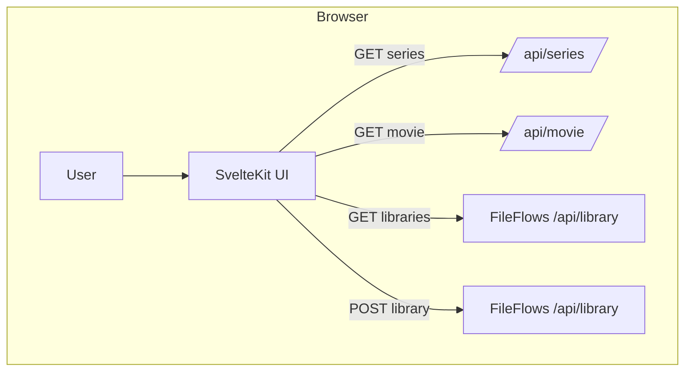

# Flowarr Architecture

## 1. Overview
Flowarr is a lightweight SSG that:
- Reads series from Sonarr & movies from Radarr
- Shows posters in a SvelteKit UI running on Bun
- Checks existing FileFlows libraries by path
- Lets you manually add any item to FileFlows with one click

## 2. Components
- **Config**
  - `config.json` holds Sonarr URL/API-key, Radarr URL/API-key, and FileFlows URL.
- **UI (SvelteKit on Bun)**
  - **Config Page** for saving endpoints & keys
  - **Collection Page** listing Sonarr series & Radarr movies with posters
  - **PosterCard** component with “Add to FileFlows” button

## 3. Data Flow

## 4. Tech Stack
- **Frontend**: SvelteKit (SSG) + Tailwind CSS
- **Runtime**: Bun
- **Persistence**: Local `config.json`

## 5. Next Steps
1. Scaffold SvelteKit project with Bun
2. Build config loader/saver
3. Implement Sonarr & Radarr API clients
4. Implement FileFlows client
5. Create UI pages & PosterCard with “Add to FileFlows” action